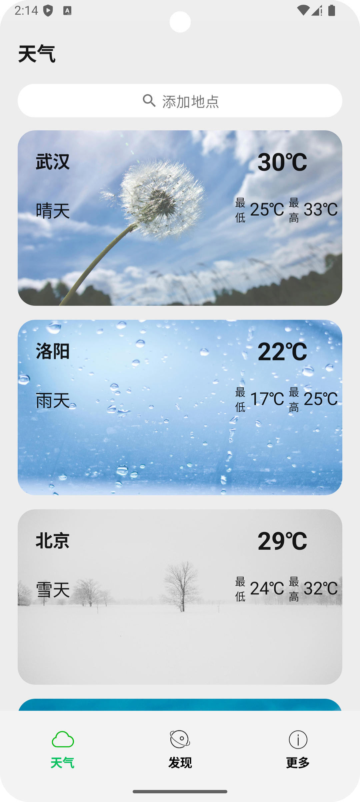
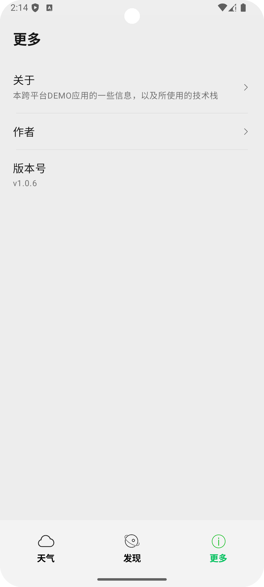
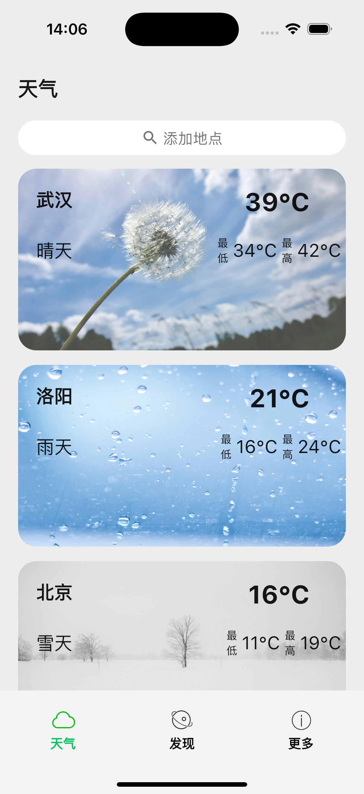
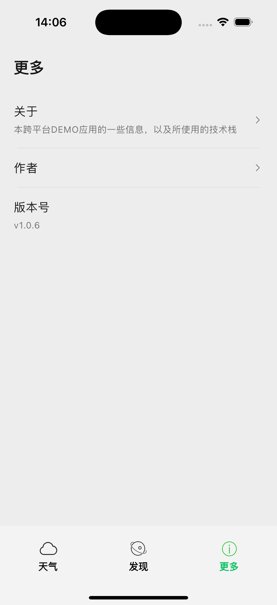

# SimpleWeather
This is a Compose Multiplatform project targeting Android, iOS, Desktop.

## 功能描述
1. 基础Weather功能，从网路获取天气展示到界面。天气api没有开通付费，每天免费50次。开发阶段获取一
次作为假数据，套用其格式， 验证多平台的链路都已经打通即可；
2. discovery页搁置，没有后端对接，设计为一些生活服务；
3. about页简单展示应用相关的一些信息；

## 技术架构
1. App architecture为谷歌推荐的一般的MVI架构，viewmodel层下从数据层获取数据，上通过State驱动页面；
2. IOS和Android端分别自己配置版本号，应用图标，关闭HTTP安全检测；
3. 跨平台日志框架为Napier，依赖注入使用Koin，页面导航为官方的Navigation框架；
4. Android端沉浸式调用edgetoedge，IOS端Safe Area（安全区域）是指不与导航栏、标签栏、工具栏或其他视
图控制器提供的视图重叠的内容空间。通过配置忽略掉safeArea实现沉浸式界面。注意需要在Compose中主动预留出相
关区域，避免被双端的系统UI遮挡。
5. 待实现预期功能：
      * 触发刷新时调用双端系统的震动器，实现震动效果；
      * IOS端实现无网络判断接口，并通过按钮跳转到系统设置页；
      * 。。。
 
## 软件截图
Android首页：

{:width="200" height="400"}

Android关于页：

{:width="200" height="400"}

IOS首页：

{:width="200" height="600"}

IOS关于页：

{:width="200" height="600"}
